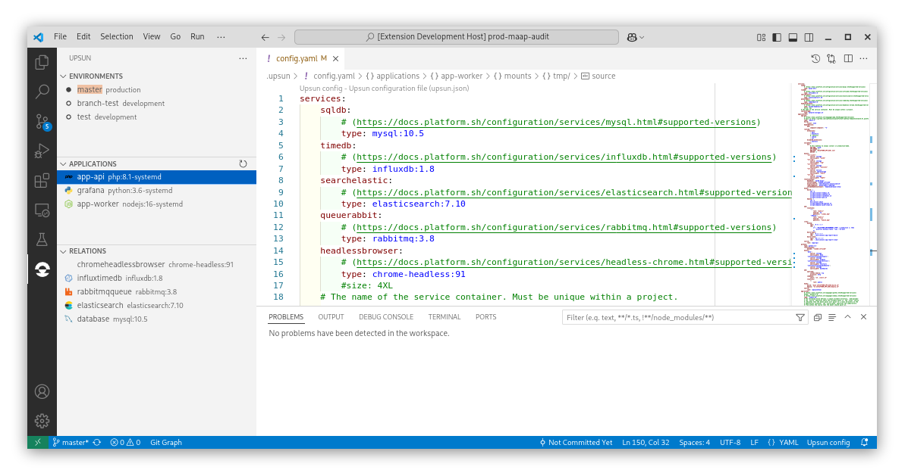

# VSCode Upsun

Upsun is the Cloud Application Platform that lets developers focus on building great applications, not infrastructure.

This extension has a command palette to run Upsun CLI commands directly from within **VSCode**, without needing to switch to a shell.



Visit [website](https://upsun.com/) for more information about Upsun.

## Features

- Install Upsun CLI
- Install 3th party tools (ClonSun, ConvSun, FastSun...)
- Open/list public URLs of your project routes
- Open Upsun console
- Open SSH session
- See logs container (syslog, http_access...)
- Enable/Disable project environment
- Redeploy a environement
- Yaml configuration validation

All these features are designed to work in all VSCode based editors such as VSCode Insiders, VSCodium, vscode.dev, [cursor.com](https://www.cursor.com/how-to-install-extensions), and GitHub Codespaces.

### Install Upsun CLI

This extension works on top of the upsun CLI. After installing the extension you need to install the CLI. Go to walkthout...

### Install 3th party tools

- [ConvSun](https://github.com/upsun/convsun) : Tool for convert Platform.sh configuration to upsun configuration (not just a merge !)
- [ClonSun](https://github.com/upsun/clonsun) : Tool for clone a project (any provider of Platform.sh) to another project (created by tool).
- [FastSun](https://github.com/upsun/fastsun) : UI to manage Fastly/CDN.

### Open/list public preview URL, Upsun console, SSH

Quick access (cmd+p) to:
- List of web-site URL define in route section.
- Open upsun console.
- Open terminal (bult-in VScode) on SSH to project.
- and more...

## Requirements

- [Upsun's CLI](https://docs.upsun.com/development/cli.html#1-install) (use walkthroughs wizard)
- Vscode.git (installed with this extension)
- Redhat.vscode-yaml (installed with this extension)

## Demo

Here's a quick rapid-fire demo GIF of some of the features of this extension.


## Contribute

### Building locally

```
npm install
./scripts/package_make.sh
```

which should output dist/upsun-cli-x.x.x.vsix that you can locally install
