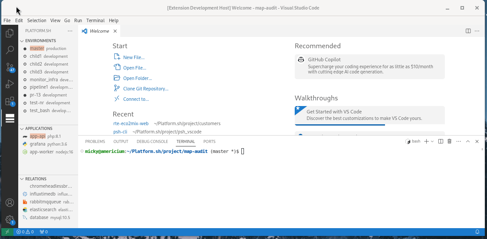

# Add new command PSH

On this snippet (eg. environment:ssh):
- **command_name**: _ssh_
- **subject**: _environment_

replace all `<xxxx>` by the value. (Keep Case Types)

## Create command class

Create new file on `src/command/<subject>/<command_name>.ts` \
With this content:
```ts
'use strict';

import * as vscode from 'vscode';
import { PshContextCommand } from "../base";


const CLI_CMD = 'foo:bar';                      // Map console command here.
export class <Command_name>Command extends PshContextCommand {

    displayMessage(): string {
        return `Custom msg `;                   // Define display message here (you can use ${this.context...})
    }

    prepare(): string {
        return `${CLI_CMD} -y ${this.context}`; // You can custom CLI call here. (All context parameter is pass here (eg. project_id, environment))
    }

    process(param: any) {
       // insert here the workflow of this command.
    }

}
```

## Register you new command.
Edit the register of the subject (eg. environment:*) on `src/command/<subject>/register.ts` \
and append in `register<Subject>` funtion this content:
```ts
    context.subscriptions.push(
        vscode.commands.registerCommand('psh-cli.<subject>:<command_name>', async () => {
            const [pshCli, ctx] = Tools.makeCliContext(context);
            await pshCli.executeObj(new <Command_name>Command(ctx, true)).then(
                // Post-process (can be call another command)
                // or call UX update
            });
            pshCli.dispose();
        })
    );
```

## Declare registered command.
On `package.json`, 

add into section `activationEvents`.
```js
    "onCommand:psh-cli.<subject>:<command_name>",
```

add into section `contributes.command`
```js
      {
        "command": "psh-cli.<subject>:<command_name>",
        "title": "title_here",
        "category": "Platform.sh"
      },
```

Enjoy !

